# SPEAR+: Streaming-Based Multi-Channel SDR Implementation Using the RFSoC Platform

Welcome to the **SPEAR+** repository! This project presents an enhanced software-defined radio (SDR) platform built on the [Xilinx RFSoC ZCU216](https://www.amd.com/en/products/adaptive-socs-and-fpgas/soc/zynq-ultrascale-plus-rfsoc.html) board, designed for real-time streaming of wideband, multi-channel signals.

SPEAR+ (Streaming-Based Python-Enhanced RFSoC) enables experimental research in wideband MIMO, D-band communications, and high-resolution sensing by providing a flexible, high-performance, and open-source SDR framework.

## Overview

SPEAR+ bridges the gap in wideband multi-channel research by providing a real-time streaming architecture that supports:
- **High Aggregated Bandwidth:** Up to 1.2 GHz real-time bandwidth across multiple channels.
- **Scalable MIMO Configurations:** Ready-to-use designs for 2T2R, 4T4R, 8T8R, and 16T16R.
- **Deterministic Data Transfer:** Hardware-assisted streaming DMA using custom FSMs to ensure reliable data movement between DRAM and RF data converters.
- **Multi-Tile Synchronization (MTS):** Precise timing and phase synchronization across all 16 DACs and 16 ADCs.
- **D-band Integration:** Proven performance at 135 GHz using the CHARM D-band transceiver modules.
- **Pythonic Interface:** A high-level software stack based on PYNQ for rapid prototyping and signal processing.

## System Architecture

The core of SPEAR+ is a DRAM-centric architecture that decouples timing-critical DMA control from the CPU, offloading it to custom PL-based finite state machines (FSMs).

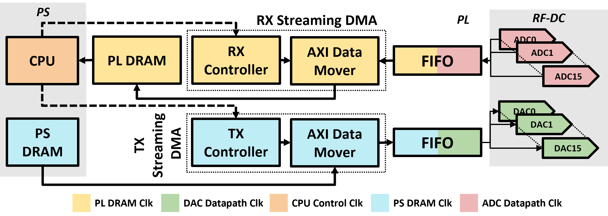

### Key Components:
- **Hardware-Assisted Streaming DMA:** Built on Xilinx's AXI Data Mover IP, ensuring deterministic, high-speed data transfer (up to 42.6 Gbps) without CPU busy-waiting.
- **Multi-Channel Datapath:** Optimized AXIS combiner/de-combiner logic to distribute memory bandwidth across multiple RF channels.
- **MTS Mechanism:** Utilizes the CLK104 daughter board and LMK04828/LMX2594 chips for cross-tile synchronization.

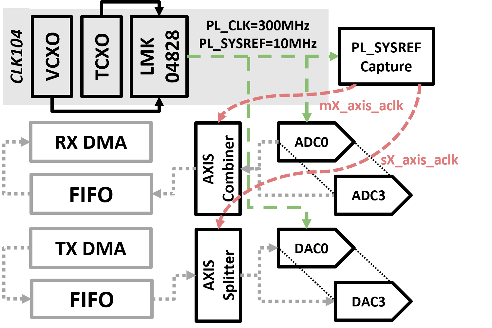

## Experimental Setup

The platform has been validated across five major configurations (C1–C5), including wired, sub-6 GHz OTA, and 135 GHz D-band OTA links. For D-band experiments, SPEAR+ is integrated with the Berkeley CHARM modules.

<p align="center">
  
  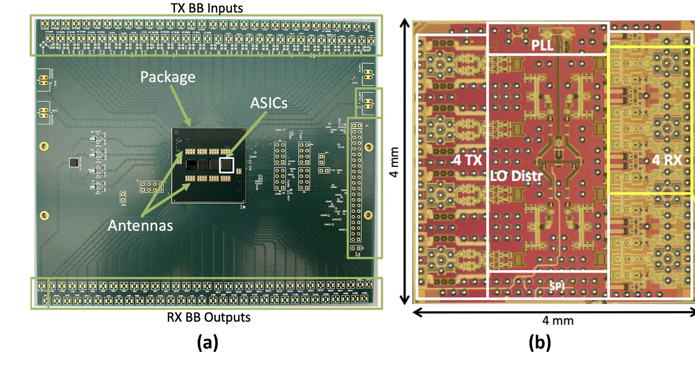
</p>

| Config | Setup | Bandwidth | Carrier Frequency | Front-End |
|:---:|:---:|:---:|:---:|:---:|
| **C1** | 1T1R | 600 MHz | 800 MHz | Wired Loopback |
| **C2** | 1T1R | 600 MHz | 800 MHz | Sub-6 GHz Antennas |
| **C3** | 1T1R | 600 MHz | 135 GHz | CHARM D-band Module |
| **C4** | 2T2R | 600 MHz | 800 MHz | Sub-6 GHz Antennas |
| **C5** | 4T4R | 300 MHz | 800 MHz | Sub-6 GHz Antennas |

## Performance Highlights

### 1. 1T1R Link Performance (Wired, OTA, CHARM)
SPEAR+ supports modulations from QPSK to 256-QAM. At 135 GHz (CHARM), the system meets 3GPP EVM requirements for wideband links, sustaining real-time performance with 600 MHz bandwidth.

<p align="center">
  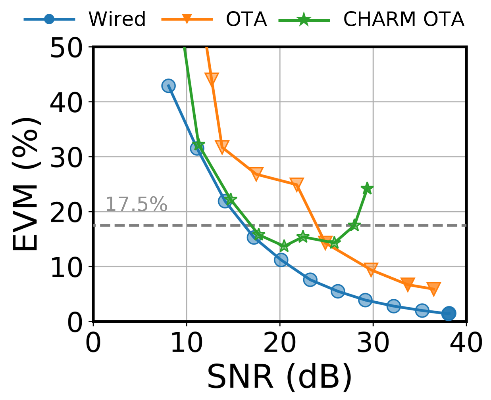
  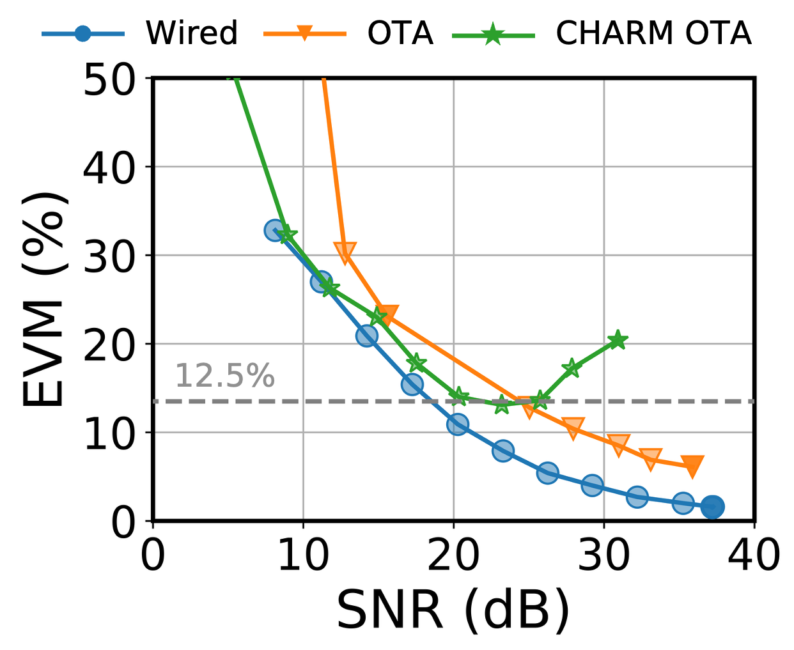
</p>
<p align="center">
  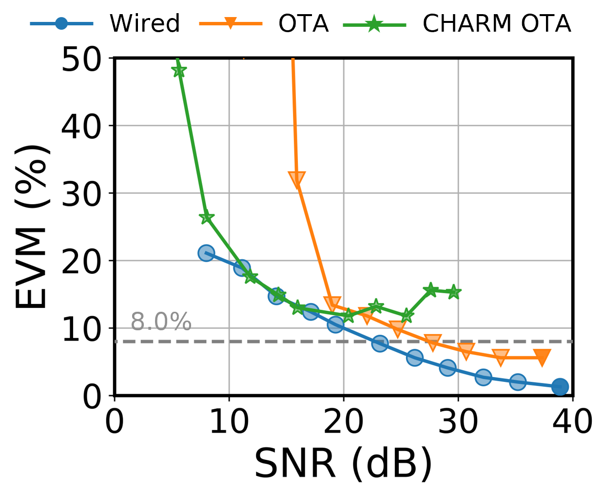
  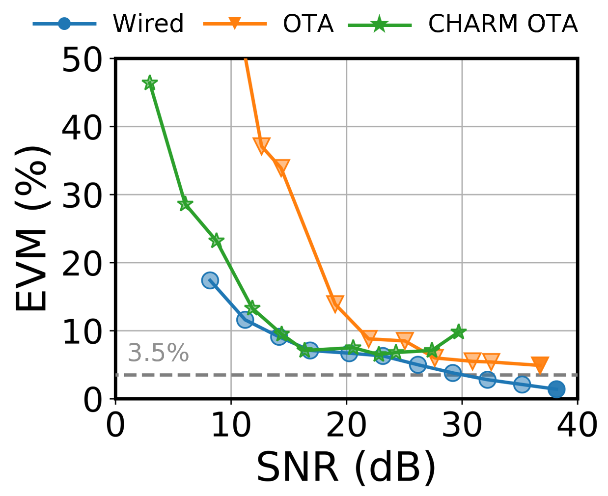
</p>

### 2. Multi-Channel MIMO Performance
Real-time 2x2 and 4x4 MIMO streaming is demonstrated with successful EVM and BER measurements across various Modulation and Coding Schemes (MCS).

<p align="center">
  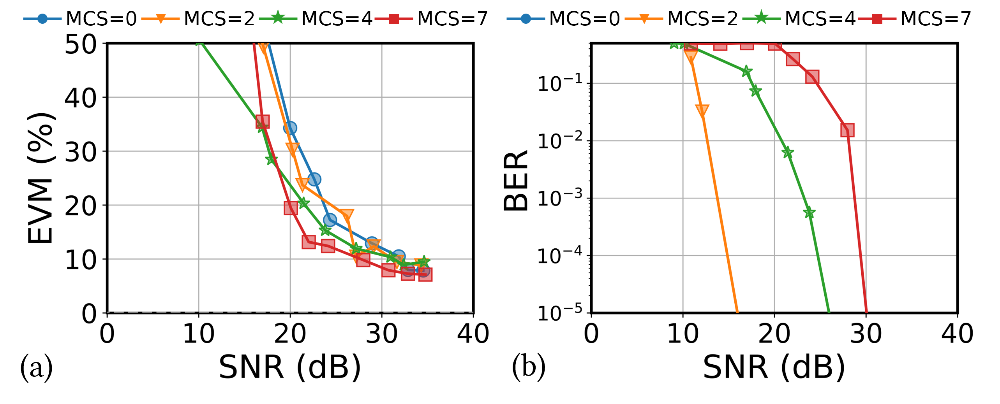
  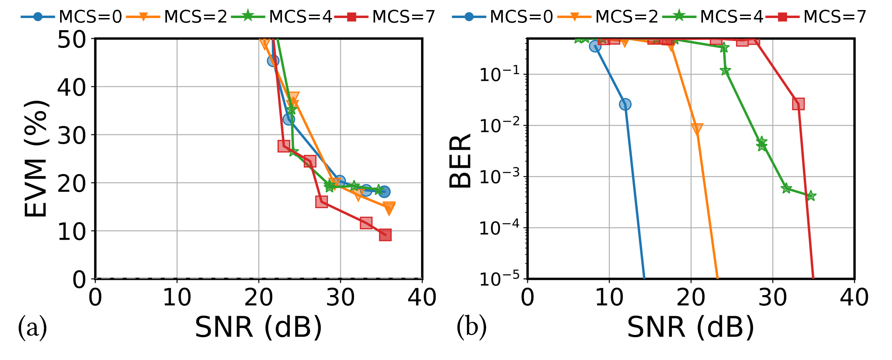
</p>

<p align="center">
  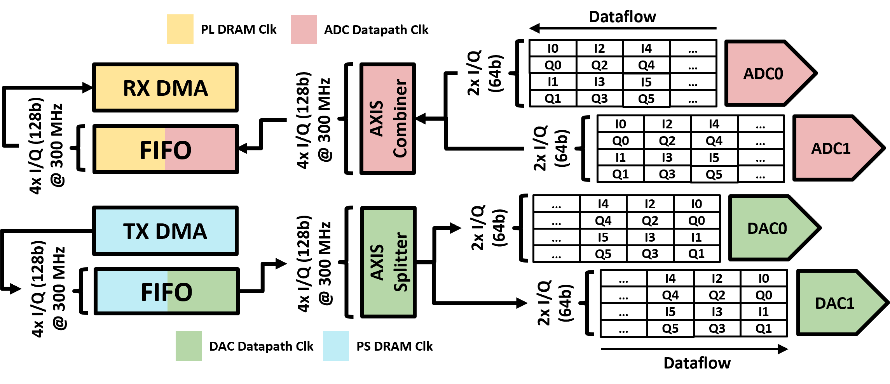
  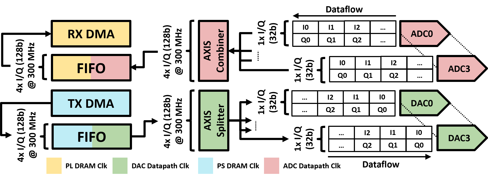
</p>

---

## Technical Instructions

### System Requirements
- **Hardware:** Xilinx RFSoC ZCU216, CLK104 Clock Board, TI Balun Boards (ADC-LD-BB).
- **Software:** Vivado 2021.1 (or newer), [PYNQ v2.7+ for ZCU216](http://www.pynq.io/board.html).

### Getting Started

1. **Clone the Repository:**
   ```bash
   git clone https://github.com/functions-lab/SPEAR_plus.git
   ```

2. **Hardware Generation:**
   Navigate to `hw_design/ZCU216/` and use the provided Makefile to generate bitstreams:
   ```bash
   # Generate 4T4R 300MHz bandwidth design
   make bd DESIGN=rfsoc_rfdc_v45_rt_4ch_mts
   make bit DESIGN=rfsoc_rfdc_v45_rt_4ch_mts
   ```

3. **Running Notebooks:**
   Upload the repository to your RFSoC board and run the provided Jupyter Notebooks for experiments:
   - `MILCOM_2025_2ch.ipynb`: 2T2R real-time experiments.
   - `MILCOM_2025_4ch.ipynb`: 4T4R real-time experiments.
   - `rfsoc_rfdc_v45_rt_16ch_mts.ipynb`: Scalability test for 16-channel MTS.

## Repository Structure
- `rfsoc_rfdc/`: Core Python library for RFSoC control.
- `hw_design/`: Vivado project scripts and IP cores.
- `figures/`: Hardware diagrams and experimental results.
- `utils/`: Benchmarking and plotting utilities.

## Citation

If you use SPEAR+ in your research, please cite our MILCOM 2025 paper:

```bibtex
@inproceedings{SPEAR+,
  author    = {Cheng, Wei and Gao, Zhihui and Guajardo, Jose and Beshary, Hesham and Niknejad, Ali and Chen, Tingjun},
  title     = {Streaming-based multi-channel {SDR} implementation using the {RFSoC} platform},
  booktitle = {IEEE MILCOM},
  year      = {2025}
}
```
